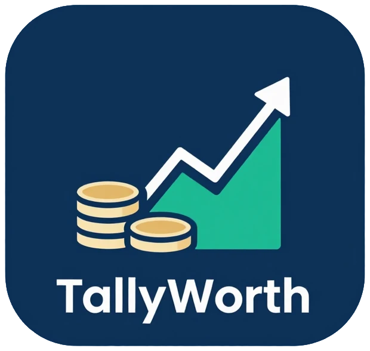
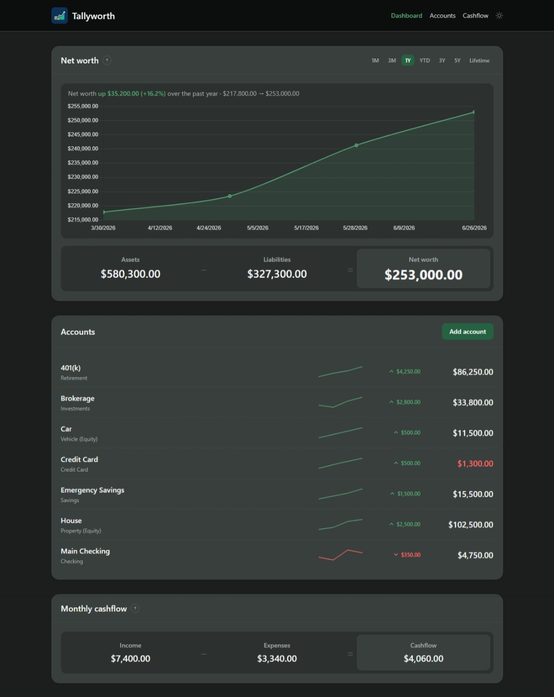
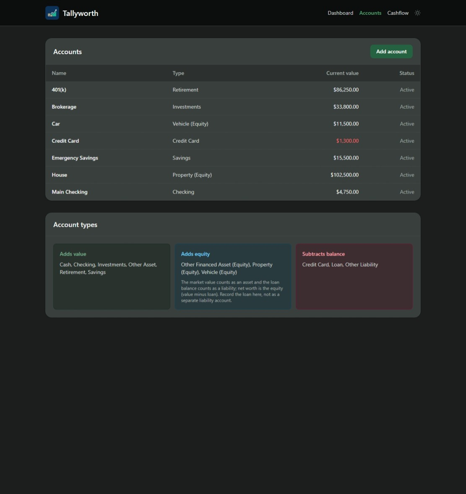
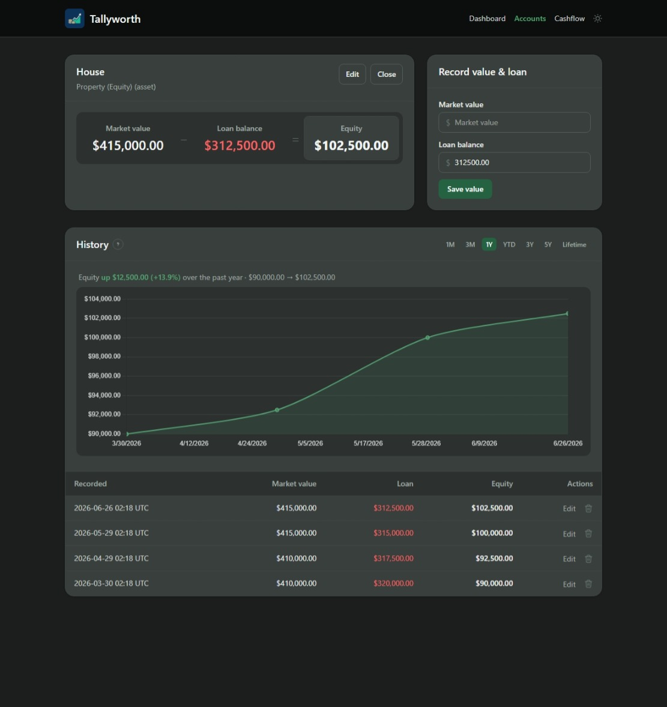
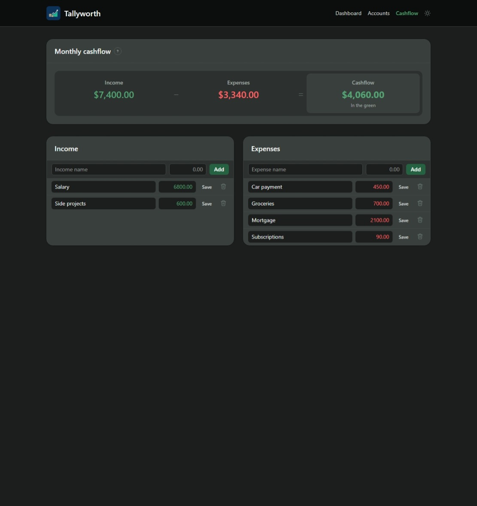

# Tallyworth

<p align="center">
  
</p>

Tallyworth is a simple, self-hosted web app for tracking your personal net worth
over time. Think of it as a tidy spreadsheet that lives in your browser: you add
your accounts, update their values whenever you like, and Tallyworth shows you
where you stand and how things are trending.

It is intentionally small. Tallyworth is **not** a budgeting app, a transaction
tracker, or a financial planning tool. It does not connect to your bank. You are
in full control of the numbers you enter.

<p>
  
  
    
  
</p>

## What it does

- **Track accounts of any kind.** Add an account with a name and a value, such as
  a checking account, a savings account, a brokerage account, or anything else.
- **Keep a running value.** Each account holds a running history of values. When
  your checking balance changes, you record the new value; the latest value is
  the current one, and the history is kept for charts.
- **Separate assets from liabilities.** Mark account types as assets (things you
  own) or liabilities (things you owe). Liabilities subtract from your net worth.
- **Choose an account type.** Pick from a fixed set of built-in types
  (checking, savings, investments, retirement, property, vehicle, credit card,
  loan, and more). Each type defines how the account counts toward net worth.
- **Track equity on financed assets.** For things like a house or a car, record
  both the market value and the outstanding loan. Tallyworth counts the equity
  (value minus loan) toward your net worth.
- **See how you're trending.** Every account has its own value-over-time chart,
  and the dashboard shows your total net worth over time. Pick a timeframe
  (1M, 3M, 1Y, YTD, 3Y, 5Y, or lifetime) and Tallyworth summarizes how much your
  net worth went up or down over that period.
- **Note your monthly cash flow.** Record recurring monthly income and expenses
  to see whether your month is in the green or the red. This is informational
  only and does not affect your net worth.
- **Dark mode.** Toggle between light and dark themes from the top navigation;
  your choice is remembered in your browser.
- **Pick your currency.** Set your display currency once via an environment
  variable (see the configuration table below).

## Getting started

### Run with Docker (recommended)

```yaml
# docker-compose.yml
services:
  web:
    image: ghcr.io/kernelkaribou/tallyworth:latest
    ports:
      - "8000:8000"
    volumes:
      - ./tallyworth-data:/data
    environment:
      PUID: 1000
      PGID: 1000
      TZ: America/New_York
    restart: unless-stopped
```

```sh
docker compose up -d
```

Then open <http://localhost:8000>. That's it. There is no authentication, so run
it on a trusted network or behind your own access controls.

Everything persistent lives in one place: the **`/data`** volume. Bind it to a
host folder (`./tallyworth-data` above) and it holds the SQLite database and an
auto-generated secret key, so your data and sessions survive restarts and
upgrades. There is nothing to configure first: migrations run and the built-in
account types are seeded automatically on startup, and a secret key is created
the first time it boots.

### Configuration

Tallyworth runs with zero configuration. Everything below is optional:

| Variable           | Default                   | Description                                                                 |
| ------------------ | ------------------------- | --------------------------------------------------------------------------- |
| `PUID` / `PGID`    | `1000` / `1000`           | Host user/group id that should own files on the data volume.                |
| `TZ`               | UTC                       | Timezone for displayed snapshot dates and container clock, e.g. `America/New_York`. Data is always stored in UTC. |
| `DEFAULT_CURRENCY` | `USD`                     | ISO code (USD, EUR, GBP, JPY, CNY, CAD, AUD, CHF, INR, KRW, BRL, MXN, SEK, NZD, ZAR). Unknown codes fall back to USD. |
| `CURRENCY_SYMBOL`  | (from `DEFAULT_CURRENCY`) | Raw symbol override for a currency not in the list. Wins over `DEFAULT_CURRENCY`. |

## Development

Tallyworth is a Flask application. To run it locally without Docker:

1. Create a virtual environment and install dependencies:

   ```sh
   python -m venv .venv
   . .venv/bin/activate
   pip install -r requirements-dev.txt
   ```

2. Build the stylesheet (requires Node.js):

   ```sh
   npm install
   npm run build:css
   ```

3. Apply migrations, seed the built-in types, and run the app:

   ```sh
   export FLASK_APP=wsgi.py
   flask db upgrade
   flask seed-types
   flask run
   ```

   Then open <http://localhost:5000>. A secret key is auto-generated under
   `./data` on first start, so there is nothing to configure.

### Common tasks

- **Run the tests:** `pytest`
- **Rebuild CSS after template changes:** `npm run build:css` (or `npm run watch:css`)
- **Create a migration after a model change:** `flask db migrate -m "describe change"` then `flask db upgrade`

## Tech stack

- **Backend:** Flask + SQLAlchemy + Flask-Migrate (Alembic), served by gunicorn
- **Database:** SQLite (single file in `/data`)
- **Frontend:** server-rendered Jinja templates, Tailwind CSS, a touch of HTMX, Chart.js
- **Security:** CSRF-protected forms (Flask-WTF) and a strict Content-Security-Policy
- **Deploy:** single Docker image, one mounted volume, zero required config

## Why This?

Having used budgeting software for many years and doing the daily transaction entries and getting down to each individual expenditure, a point was reached where money habits were well established and became more interested in just loosely tracking larger networth values and investments. This could absolutely be a spreedsheet. 

If you are interested in more budgeting type software to really get a grasp of your dollars check out some of the known ones out there like Actual Budget, Firefly III or YNAB (if you feel like paying for something).  

## Disclaimer

AI was used heavily to create this project. As long as it is being used i will keep it maintained but at this point there is really no other updates needed unless a compelling feature comes up.

Tallyworth is provided as-is for personal tracking. It is not financial advice.
Any figures and summaries it shows are based solely on the numbers you enter.
Always keep your own records and verify important figures yourself.
